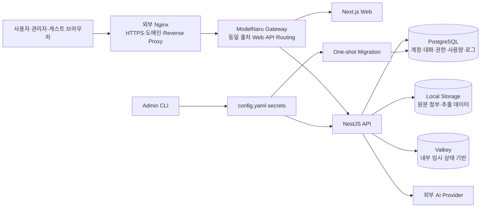

# ModelNaru

여러 모델로 건너가는 하나의 대화 공간.

ModelNaru(모델나루)는 여러 AI 제공자와 모델을 한곳에 등록하고, 관리자가 허용한 사용자와 게스트가 서로 분리된 공간에서 이용할 수 있게 만든 셀프호스팅 AI 채팅 웹 서비스입니다.

공개 회원가입으로 사용자를 모으는 범용 SaaS가 아니라, 소규모 개인 운영 환경에서 계정·모델 권한·사용량·파일 보관·운영 기록을 직접 통제하는 것을 목표로 합니다. OpenAI 호환 API를 포함한 여러 Provider를 하나의 대화 UI로 연결하면서도 사용자별 데이터 경계와 관리자 권한을 분명하게 유지합니다.

> 현재 저장소는 실제 배포와 핵심 기능 검증이 진행된 개발 버전입니다. 구현 완료 기능과 아직 계약 검증 또는 전용 Adapter가 필요한 기능은 아래에서 구분합니다.

## 왜 만들었나

AI 서비스마다 별도의 웹 화면을 사용하면 대화가 흩어지고, 모델 설정과 API 키 관리 방식도 제각각이 됩니다. ModelNaru는 다음 문제를 한 서비스 안에서 해결합니다.

- 여러 AI 제공자의 모델을 한곳에서 선택하고 대화를 이어갑니다.
- 모델을 바꿔도 같은 대화방의 문맥과 첨부 설정을 유지합니다.
- 관리자가 사용자별로 사용할 수 있는 모델과 호출 한도를 정합니다.
- 사용자·게스트마다 대화, 메시지, 첨부파일과 컨텍스트를 분리합니다.
- API 키와 관리자 비밀정보를 브라우저에 노출하지 않습니다.
- 장시간 대화, 큰 응답, 파일 처리와 스트리밍을 개인 서버 자원 안에서 안전하게 제어합니다.

## 역할

### 관리자

관리자는 일반 채팅 사용자와 분리된 운영 주체입니다.

- 최초 관리자 계정은 배포 폴더의 `config.yaml`에서만 관리합니다.
- 관리자 비밀번호는 Argon2id hash로 저장하고 TOTP 인증을 필수로 사용합니다.
- 공개 회원가입 없이 일반 사용자 계정을 생성·수정·비활성화·삭제합니다.
- 사용자 비밀번호를 재설정하고 활성 세션을 폐기할 수 있습니다.
- Provider 연결과 API 자격증명을 등록하고 모델 목록을 동기화합니다.
- 사용자와 게스트에게 허용할 모델 및 일일 호출 제한을 지정합니다.
- 자동 요약 모델·프롬프트·생성 파라미터를 설정합니다.
- Usage, 감사·보안·AI·파일·시스템 로그와 첨부파일 보관 상태를 조회합니다.

관리자 화면은 `Usage → 로그 → 사용자 → 게스트 → 프로바이더 → 장기기억 → 서버`로 구성됩니다. 여기서 장기기억은 임베딩 기반 검색 메모리가 아니라 오래된 대화를 압축하는 **컨텍스트 자동 요약**을 뜻합니다.

### 일반 사용자

일반 사용자는 관리자가 발급한 계정으로만 로그인합니다.

- 자신에게 허용된 Provider 모델만 선택할 수 있습니다.
- 여러 대화방을 생성·이름 변경·삭제할 수 있습니다.
- 대화방마다 모델, 생성 파라미터, 시스템 프롬프트와 문맥 범위를 따로 저장합니다.
- 답변을 스트리밍으로 받고 생성 중단·재생성·답변 분기 전환을 사용할 수 있습니다.
- 텍스트 문서, PDF와 이미지를 첨부할 수 있습니다.
- 현재 로그인 세션에서 최근 Provider 요청·응답 진단 기록을 확인하고 삭제할 수 있습니다.

대화 제목이 같아도 내부 대화 UUID가 다르면 설정과 메시지를 공유하지 않습니다. 서버는 모든 조회·수정에서 로그인 주체와 데이터 소유권을 다시 검사합니다.

### 게스트

게스트는 ModelNaru의 구성을 소개하고 실제 채팅을 체험시키기 위한 임시 사용자입니다.

- 관리자가 게스트 체험을 활성화하고 공유 코드를 설정한 경우에만 참가할 수 있습니다.
- 같은 코드를 입력해도 방문자마다 별도 임시 주체와 세션을 발급합니다.
- 게스트끼리 대화·메시지·첨부파일과 컨텍스트를 공유하지 않습니다.
- 관리자가 허용한 모델과 세션별·전체 일일 호출 한도 안에서만 요청할 수 있습니다.
- 로그아웃 또는 세션 만료 시 임시 대화와 파일은 정리 대상이 됩니다.

공개 계정 하나를 여러 사람이 공유하는 방식이 아니므로, 다른 체험자의 대화가 보이거나 문맥에 섞이지 않습니다.

## 주요 기능

### 1. 인증과 계정 분리

- 공개 회원가입 없음
- 고정 관리자 1개와 관리자 생성 일반 사용자
- 관리자 비밀번호 최소 10자 + TOTP 필수
- 일반 사용자 비밀번호 최소 8자
- 게스트 공유 코드 최소 6자, Argon2id hash 저장
- 계정당 최대 3개 활성 세션
- 네 번째 로그인 시 가장 오래 사용하지 않은 세션 자동 폐기
- 기본 24시간 idle timeout, 로그인 후 최대 7일 absolute timeout
- 비밀번호 변경·계정 비활성화·삭제 시 기존 세션 즉시 폐기
- `HttpOnly`, `Secure`, `SameSite` 쿠키와 double-submit CSRF 검증
- 로그인 시도 제한과 관리자 작업 감사 기록

### 2. Provider와 모델 관리

Provider 카탈로그는 `provider-manager-v1.10.0.js`의 Registry와 설정 구조를 분석해 서버용 Template·Connection·Credential·Model 구조로 재구성했습니다. 참고 플러그인의 런타임이나 저장 형식을 그대로 실행하지는 않습니다.

- Provider 선택, 연결 이름과 API 키 중심의 간편 등록
- Provider별 고정 HTTPS Endpoint와 인증 Header 구성
- API 키 연결 검증 및 모델 목록 자동 조회
- 원격 모델과 정적 모델 목록 병합
- 사라진 모델을 즉시 삭제하지 않고 사용 불가 상태로 관리
- 연결·모델 활성화와 사용자/게스트 권한 분리
- API 키 AES-256-GCM 암호화 저장 및 화면 마스킹
- Provider·모델 등록 및 상태 변경 감사 기록
- OpenAI, Anthropic, Google AI Studio, Vertex AI 우선 표시 후 나머지 Provider 알파벳순 정렬

현재 채팅 런타임은 다음 세 Protocol을 공통 요청·이벤트 형식으로 정규화합니다.

| Protocol                     | 주요 대상                                | 현재 처리                                                      |
| ---------------------------- | ---------------------------------------- | -------------------------------------------------------------- |
| OpenAI 호환 Chat Completions | OpenAI 및 다수 API Gateway·호환 Provider | 요청 변환, 이미지 입력, SSE, Usage 정규화                      |
| Anthropic Messages           | Claude 계열                              | System·Content Block, 이미지 입력, Thinking 관련 파라미터, SSE |
| Gemini GenerateContent       | Google AI Studio 계열                    | Content·Part, 이미지 입력, Thinking 관련 파라미터, Streaming   |

LLM Gateway와 OpenAI 실제 키를 이용한 모델 조회·대화가 확인됐고, 세 Protocol의 요청 Builder와 Stream Parser는 Fixture 계약 시험을 포함합니다. Vertex AI, AWS Bedrock, GitHub Copilot처럼 별도 서명 또는 OAuth 흐름이 필요한 Provider는 카탈로그에 보이지만 전용 인증 Adapter가 완성될 때까지 `준비 중`입니다. Gemini Express와 NovelAI도 실제 계약 검증이 남아 있습니다.

### 3. 대화방별 모델 설정

모든 설정은 대화방 UUID 단위로 저장됩니다.

- 대화 제목
- 기본 Provider 모델
- Temperature, Top P, Top K
- 최대 출력 토큰
- Frequency·Presence Penalty
- Seed
- Reasoning Effort, Thinking Budget, Verbosity 등 모델별 고급 파라미터
- 이전 메시지 수
- 컨텍스트 토큰 목표값
- 응답 타임아웃
- 시스템 프롬프트
- 최근 요청·응답 기록 보관 개수

각 파라미터에는 설명, Provider 기본 동작과 `직접 설정` 여부를 표시합니다. 모델이 지원하지 않거나 Reasoning 설정과 충돌하는 값은 UI에서 이유와 함께 비활성화하고, 서버에서도 허용 목록·자료형·범위를 다시 검증한 뒤 지원 값만 전송합니다.

일반 대화의 새 Temperature 직접 설정 기본값은 `1.0`입니다. GPT 추론 모델처럼 Sampling 값을 받지 않는 모델에서는 저장된 값이 있더라도 요청에서 안전하게 제외됩니다.

응답 타임아웃은 Provider 생성 파라미터가 아니라 ModelNaru 서버의 실행 제한입니다. 첫 응답 또는 다음 Streaming Chunk가 설정 시간 안에 도착하지 않으면 Upstream 요청을 중단하고 전용 오류를 반환합니다.

### 4. 스트리밍, 중단과 답변 분기

- Provider SSE를 공통 `start`, `text_delta`, `usage`, `done`, `error` 흐름으로 변환
- 답변이 생성되는 동안 브라우저에 실시간 표시
- 사용자 중단을 `AbortController`로 Upstream 요청까지 전달
- 완료·실패·취소 상태와 실제 사용 모델·파라미터 Snapshot 저장
- 모델을 중간에 변경해도 같은 대화의 활성 문맥 유지
- 마지막 AI 답변만 재생성 가능
- 재생성 답변을 기존 답변 위에 덮어쓰지 않고 별도 Branch로 보존
- 같은 질문에서 생성된 정상 답변을 좌우 화살표로 선택
- 선택한 활성 Branch만 다음 요청의 컨텍스트에 포함
- 최근 메시지 50개 우선 조회와 Cursor 기반 이전 메시지 Pagination

응답 완료 후 전체 작업공간을 다시 불러오지 않고 필요한 메시지와 대화 목록만 갱신합니다. 느린 요청 뒤에 다른 대화를 선택해도 이전 응답이 새 화면을 덮어쓰지 않도록 요청 취소와 최신 요청 세대 검사를 사용합니다.

### 5. 컨텍스트 자동 요약

- 이전 메시지 수 `0`은 현재 활성 Branch의 전체 대화를 의미합니다.
- 대화방별 컨텍스트 토큰 목표 기본값은 100,000입니다.
- 실제 적용값은 사용자 설정, 모델 입력 한도와 서버 안전 한도 중 가장 작은 값입니다.
- 한도를 넘으면 오래된 메시지 구간부터 별도 요약 모델로 압축합니다.
- 원본 메시지는 삭제하지 않고 `context_summaries`에 요약본과 포함 범위를 버전별로 저장합니다.
- 이후 요청은 요약문과 아직 요약하지 않은 최근 원문을 함께 참고합니다.
- 요약 모델, 프롬프트, Temperature·Top P·Top K·최대 출력 등은 관리자가 설정합니다.
- 요약 실패 시 원문을 임의로 잘라 Provider에 보내지 않고 사용자에게 오류를 알립니다.

현재 방식은 대화 순서를 압축하는 요약이므로 Vector DB나 Embedding 검색이 필요하지 않습니다.

### 6. 파일과 이미지

메시지 하나에 최대 10개, 파일 하나당 기본 10MB까지 첨부할 수 있습니다.

#### 텍스트 계열

- 문서: TXT, Markdown, JSON, JSONL, CSV, TSV, LOG, XML, YAML
- 소스: JavaScript, TypeScript, JSX, TSX, Python, Java, C/C++, C#, Go, Rust, PHP, Ruby, Shell, PowerShell, SQL, HTML, CSS
- UTF-8, UTF-8 BOM, UTF-16과 CP949 감지
- 확장자, MIME, Binary 포함 여부와 추출 문자 수 검증

#### PDF

- 텍스트 Layer가 있는 PDF 본문 추출
- 파일당 기본 최대 100페이지
- 암호화·손상·페이지 초과 상태를 구분한 오류
- 스캔 PDF는 컨테이너 내부 Poppler와 Tesseract를 사용해 한국어·영어 OCR 수행
- OCR 처리 상태와 추출 결과 저장

#### 이미지

- JPEG, PNG, WebP
- 실제 파일 Signature·MIME 및 Pixel 수 검증
- 이미지 입력 Capability가 있는 모델에만 전송
- 같은 요청에 포함되는 모든 이미지의 합계 Byte 상한 적용
- Provider 형식에 따라 OpenAI Image URL, Anthropic Source 또는 Gemini Inline Data로 변환

GIF, HEIC, DOCX, 실행 파일과 이미지 생성은 지원 범위에 포함하지 않습니다.

### 7. 첨부파일 수명주기

- 원본 파일과 추출 텍스트를 Web 공개 경로 밖에 저장
- 내부 저장 이름으로 UUID 기반 Storage Key 사용
- 첨부별 `후속 메시지에도 포함` 선택
- 기본 보관 기간 30일, 관리자 화면에서 변경 가능
- 만료 시 원본과 추출 내용은 삭제하고 파일명·크기·페이지 등 Metadata만 보존
- 대화·사용자·게스트 삭제 시 관련 원본을 Cleanup Queue로 정리
- 서버 시작 후와 주기 실행으로 만료·고아 파일 자동 정리
- 파일 처리 Worker와 대기 Queue에 상한을 두어 OCR·PDF 동시 업로드가 서버를 점유하지 않도록 제한

악성 파일 검사 엔진은 아직 포함하지 않았습니다. 현재는 허용 형식·크기·MIME·구조 검증과 비공개 저장을 적용합니다.

### 8. Usage와 관리자 통합 로그

관리자 기본 화면은 Usage Dashboard입니다.

- 기간: 10분, 1시간, 6시간, 12시간, 1일, 1주, 30일
- 전체 요청, 성공률, 입력·출력 Token과 처리 시간
- 사용자·게스트별 집계
- Provider·모델별 집계
- 일반 채팅과 자동 요약 호출 구분
- 완료·실패·취소 상태와 최근 요청 조회

통합 로그는 AI, 인증·보안, 관리자 감사, 파일 처리와 시스템 작업을 범주별로 조회합니다. 기간·수준·상태·검색 Filter, 상세 화면, CSV Export, 범주별 보관 기간과 수동 Cleanup을 제공합니다.

관리자 통합 로그에는 사용자 대화 본문을 저장하거나 표시하지 않습니다. Provider 요청·응답 전체 확인이 필요한 경우 사용자 또는 게스트가 자신의 대화 설정에서 세션 한정 **전송 기록**을 활성화합니다.

- 대화별 최근 0~3개 표시
- 세션 전체 기록 수와 메모리 Byte 상한 적용
- 요청 본문, 최종 응답과 원시 Stream Event 확인
- API Key·Authorization·Cookie·이미지 Base64 등 민감정보 마스킹
- 현재 세션 종료·로그아웃 시 자동 삭제
- 사용자가 즉시 전체 삭제 가능

### 9. 런타임 안정성

장시간 운영과 제한된 서버 자원을 고려해 다음 경계를 둡니다.

- Provider SSE 미완성 Event Buffer 상한
- Browser SSE Buffer 상한
- HTTP Response Backpressure와 `drain` 대기
- 연결 종료 시 Stream Producer와 대기 작업 정리
- Provider 첫 응답·Chunk Idle Timeout
- PDF·OCR Bounded Semaphore와 Queue 상한
- 이미지 요청 전체 Byte Budget과 순차 Base64 변환
- Provider 요청 Body 단일 직렬화
- 요청 추적 기록의 Process 전체 Byte Budget과 O(1) ID 조회
- Provider 모델 조회 응답 Byte·항목 수 제한
- Web의 Stale Response 차단과 Fetch 취소
- 종료 Grace Period와 Docker Healthcheck

## 시스템 구성



### 계층별 책임

| 계층             | 기술                       | 책임                                                            |
| ---------------- | -------------------------- | --------------------------------------------------------------- |
| Web 진입         | 기존 Nginx                 | HTTPS 인증서와 도메인 운영, Reverse Proxy, Streaming 전달       |
| 내부 Gateway     | Nginx Container            | Web과 API를 동일 출처로 Routing하며 Host에는 이 진입점만 Bind   |
| 사용자 화면      | Next.js, React, TypeScript | 로그인, 관리자 Dashboard, 대화·설정·첨부 UI와 반응형 Theme      |
| Application API  | NestJS, TypeScript         | 인증·권한, 대화 상태, Provider 변환, 파일 처리, Usage와 로그    |
| 영구 데이터      | PostgreSQL                 | 사용자·세션·Provider·대화·분기·첨부 Metadata·사용량의 기준 원장 |
| 파일 저장        | Local Filesystem           | 원본 첨부와 임시 처리 결과, 보관·만료·삭제                      |
| 내부 보조 서비스 | Valkey                     | 향후 Cache·Queue 등 임시 상태 확장을 위한 내부 전용 기반        |
| 배포             | Docker Compose             | Gateway·Web·API·Migration·PostgreSQL·Valkey 역할 분리           |

PostgreSQL과 Valkey는 Host Port로 공개하지 않고 내부 Docker Network에서만 통신합니다. 현재 영구 업무 데이터의 기준 원장은 PostgreSQL이며 Valkey에만 의존하는 영구 기능은 두지 않습니다.

## 기술 스택

- Node.js 24
- pnpm Workspace Monorepo
- TypeScript
- Next.js 16, React 19
- NestJS 11
- PostgreSQL 17, `postgres.js`, Versioned SQL Migration
- Valkey 8
- Docker Compose
- Nginx
- Argon2id, TOTP, AES-256-GCM
- PDF.js, Poppler, Tesseract OCR
- Vitest, ESLint, Prettier

## 저장소 구조

```text
apps/
  api/                  NestJS API, Provider·채팅·파일·로그 서비스
  web/                  Next.js 사용자·관리자·게스트 화면
packages/
  config/               config.yaml Schema와 Loader
  database/             PostgreSQL Client와 Versioned Migration
tools/
  admin-cli/            관리자 설정·Secret 초기화 CLI
bin/
  apichat-admin         Admin CLI Container Wrapper
  modelnaru             시작·중지·상태·로그 Wrapper
deploy/
  gateway.conf          내부 Gateway Routing
scripts/
  test-runtime-stages-5-7.sh
                        런타임 안정성 통합 점검
provider-manager-v1.10.0.js
                        Provider Registry 분석용 참고 Snapshot
```

## 설치와 실행

정식 운영 절차는 [DEPLOYMENT_RUNBOOK.md](./DEPLOYMENT_RUNBOOK.md)를 따릅니다. 아래는 Ubuntu와 Docker Compose가 준비된 새 배포 폴더에서의 기본 흐름입니다.

```bash
git clone <repository-url> modelnaru
cd modelnaru

chmod +x bin/apichat-admin bin/modelnaru

./bin/apichat-admin init
./bin/apichat-admin validate
./bin/modelnaru start
./bin/modelnaru status
```

`init`은 숨김 입력으로 관리자 비밀번호와 TOTP를 설정하고, `config.yaml` 및 필요한 Secret 파일을 생성합니다. 실제 비밀번호를 설정 파일에 평문으로 기록하지 않습니다.

서비스 확인:

```bash
curl --fail http://<configured-bind-address>/api/health/live
curl --fail http://<configured-bind-address>/api/health/ready
```

운영 명령:

```bash
./bin/modelnaru start
./bin/modelnaru stop
./bin/modelnaru restart
./bin/modelnaru status
./bin/modelnaru logs
```

외부 공개 시에는 애플리케이션을 Loopback에 Bind하고 기존 Nginx가 HTTPS를 종료하도록 구성합니다. 실제 Domain, 인증서 경로와 서버 사양은 저장소 문서 예시에 기록하지 않고 각 배포 환경에서 별도로 관리합니다.

## 개발

로컬 개발에는 Node.js 24와 pnpm 11 이상이 필요합니다.

```bash
corepack enable
pnpm install --frozen-lockfile
pnpm dev
```

전체 검증:

```bash
pnpm format:check
pnpm lint
pnpm typecheck
pnpm test
pnpm build
```

현재 자동 시험은 인증·권한, Provider Registry·요청 변환·SSE, 대화·분기·요약, 파일·OCR, Usage·로그, 런타임 Buffer·Backpressure·Queue와 Web 비동기 상태를 다룹니다. 실제 자격증명이 필요한 Provider Smoke Test와 Ubuntu 통합 결과는 자동 Fixture 시험과 구분해 [PROVIDER_CONTRACT_TESTS.md](./PROVIDER_CONTRACT_TESTS.md)와 [TEST_PLAN.md](./TEST_PLAN.md)에 기록합니다.

## 설정과 비밀정보

실행 설정은 저장소 Root의 `config.yaml`에서 읽지만 이 파일은 Git에 포함하지 않습니다. 공개 가능한 구조 예시는 [config.example.yaml](./config.example.yaml)을 사용합니다.

Git에서 제외하는 주요 항목:

- `config.yaml`, `config.*.yaml`
- `secrets/`
- `data/`
- `.env`, `.env.*`, `.runtime.env`
- 인증서와 Private Key
- Runtime Log와 임시 파일

다음 값은 Source, 문서, Fixture, Screenshot 또는 Log에 기록하지 않습니다.

- 관리자·사용자·게스트의 실제 비밀번호와 코드
- TOTP Secret과 복구 Code
- Provider API Key와 암호화 Master Key
- Session Token, Cookie와 CSRF Token
- Database URL과 Private Key

## 현재 제한과 보류 항목

- 이미지 입력은 지원하지만 이미지 생성 기능은 제공하지 않습니다.
- Tool Call 응답은 안전하게 처리할 수 있지만 서버에서 외부 Tool을 실행하는 기능은 제공하지 않습니다.
- Vertex AI, AWS Bedrock, GitHub Copilot 전용 인증 Adapter는 준비 중입니다.
- Gemini Express와 NovelAI의 실제 계약 검증이 남아 있습니다.
- OpenAI Responses 전용 실행 경로와 일부 Provider 고급 기능은 명세에 포함되어 있으나 현재 기본 채팅 경로는 OpenAI 호환 Chat Completions·Anthropic Messages·Gemini GenerateContent 중심입니다.
- 관리자에 의한 사용자 대화 본문 열람은 구현하지 않았습니다.
- 악성 파일 검사 엔진은 아직 포함하지 않았습니다.
- 외부 Backup은 현재 배포 범위에 포함하지 않았습니다.
- 장기 Session Token Rotation은 보류하고 로그아웃·자격증명 변경·만료 시 폐기합니다.
- 일부 실제 Provider 자격증명 Smoke Test와 Browser E2E 자동화 범위가 남아 있습니다.

세부 상태는 [IMPLEMENTATION_STATUS.md](./IMPLEMENTATION_STATUS.md)를 기준으로 확인합니다.

## 문서 안내

### 요구사항과 진행 상태

| 문서                                                   | 내용                                           |
| ------------------------------------------------------ | ---------------------------------------------- |
| [REQUIREMENTS.md](./REQUIREMENTS.md)                   | 사용자 역할, 핵심 기능, 제한과 비기능 요구사항 |
| [SPEC_STATUS.md](./SPEC_STATUS.md)                     | 확정·미확정 항목과 구현 착수 기준              |
| [SPEC_AUDIT.md](./SPEC_AUDIT.md)                       | 명세 누락·불일치·구현 준비도 점검              |
| [IMPLEMENTATION_STATUS.md](./IMPLEMENTATION_STATUS.md) | 기능별 구현·검증·보류 상태                     |
| [DECISIONS.md](./DECISIONS.md)                         | 주요 Architecture Decision Record              |

### AI, 대화와 파일

| 문서                                                             | 내용                                                 |
| ---------------------------------------------------------------- | ---------------------------------------------------- |
| [AI_INTEGRATION_SPEC.md](./AI_INTEGRATION_SPEC.md)               | 공통 AI 요청·응답, Protocol, Streaming과 Parameter   |
| [PROVIDER_REGISTRATION_SPEC.md](./PROVIDER_REGISTRATION_SPEC.md) | Provider Template, Credential, 모델 조회와 등록 흐름 |
| [PROVIDER_CONTRACT_TESTS.md](./PROVIDER_CONTRACT_TESTS.md)       | Provider별 Fixture·실제 자격증명 계약 시험           |
| [CHAT_STATE_SPEC.md](./CHAT_STATE_SPEC.md)                       | 대화·메시지·Branch·취소·재생성·요약 상태             |
| [FILE_PROCESSING_SPEC.md](./FILE_PROCESSING_SPEC.md)             | 첨부 형식·검증·추출·OCR·보관과 삭제                  |
| [GUEST_ACCESS_SPEC.md](./GUEST_ACCESS_SPEC.md)                   | 공유 코드, 임시 세션, 격리·권한·호출 제한            |

### API, 데이터와 보안

| 문서                                             | 내용                                          |
| ------------------------------------------------ | --------------------------------------------- |
| [API_SPEC.md](./API_SPEC.md)                     | 구현 Endpoint, 인증, Request·Response와 오류  |
| [DATABASE_SCHEMA.md](./DATABASE_SCHEMA.md)       | Table, 관계, Index, Migration과 삭제 정책     |
| [SECURITY_SPEC.md](./SECURITY_SPEC.md)           | 인증, Session, CSRF, Secret, SSRF와 파일 보안 |
| [ADMIN_LOGGING_SPEC.md](./ADMIN_LOGGING_SPEC.md) | Usage·감사·운영 로그, 마스킹·보관·조회        |

### UI, 기술과 운영

| 문서                                             | 내용                                     |
| ------------------------------------------------ | ---------------------------------------- |
| [WEB_UI_SPEC.md](./WEB_UI_SPEC.md)               | Theme, 7색 역할, 화면 구조와 반응형 동작 |
| [TECH_STACK_OPTIONS.md](./TECH_STACK_OPTIONS.md) | 기술 선택 근거와 영역별 대체안           |
| [SERVER_CONFIG_SPEC.md](./SERVER_CONFIG_SPEC.md) | 시작 설정, Admin CLI, Bind와 Proxy 기준  |
| [DEPLOYMENT_PROFILE.md](./DEPLOYMENT_PROFILE.md) | 운영 환경과 자원 정책                    |
| [DEPLOYMENT_RUNBOOK.md](./DEPLOYMENT_RUNBOOK.md) | 설치·Update·Healthcheck·장애 대응        |
| [TEST_PLAN.md](./TEST_PLAN.md)                   | 단위·통합·배포 시험과 실제 결과          |

### 개발 문서 관리

| 문서                                                 | 내용                                         |
| ---------------------------------------------------- | -------------------------------------------- |
| [AGENTS.md](./AGENTS.md)                             | 개발 Agent가 따라야 할 문서 색인과 갱신 규칙 |
| [DEVELOPMENT_WORKFLOW.md](./DEVELOPMENT_WORKFLOW.md) | 개발 전·중·후 문서화 절차와 완료 조건        |

## 프로젝트 상태

핵심 서비스 흐름인 인증, 사용자 관리, Provider 등록, 모델 권한, 대화·분기·자동 요약, 첨부·OCR, Usage·로그와 Docker Compose 배포는 구현되어 있습니다. 현재 작업은 전용 인증이 필요한 Provider 확대, 남은 실제 자격증명 계약 시험, 브라우저 E2E 범위 확정과 운영 보완에 집중합니다.

기능을 변경할 때는 코드만 수정하지 않고 관련 API·DB·보안·시험 문서와 [IMPLEMENTATION_STATUS.md](./IMPLEMENTATION_STATUS.md)를 같은 변경에서 갱신합니다.

## 라이선스

아직 프로젝트 라이선스를 결정하지 않았습니다. 현재 저장소의 코드와 문서는 별도 허가 없이 재사용 가능한 공개 라이선스로 배포되지 않습니다.
