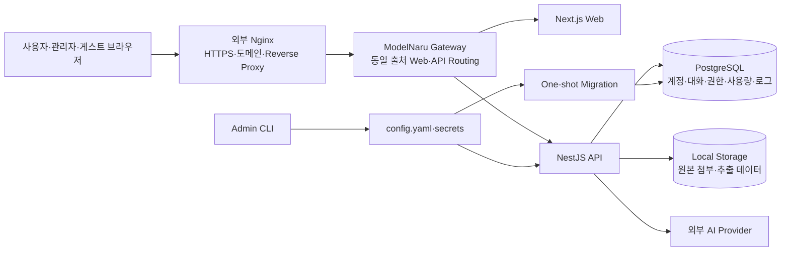

# ModelNaru

## 현재 운영: Git 기반 설치 (2026-10-02 전환 완료)

새 배포는 `codex/refactor-v2`의 Git checkout이다. 대상은 `/home/totquf4171/modelnaru-git`, project `modelnaru-git`, 공인 주소 `https://chat.mihoservice.xyz`, loopback32432다. Git 운영 전환은 완료했으며 이전 설치/백업의 sudo 삭제만 남았다. 실제 상태는 IMPLEMENTATION_STATUS.md GIT-RESET을 따른다. 아래 N14 archive 설명은 이전 기록이다.

사용자 요청으로 DB·업로드·Provider 키·관리자 비밀번호/TOTP를 새로 생성한다. 이전 계정/대화/Provider를 이전하지 않는다. 이번 자동 초기화의 관리자 정보는 서버 `secrets/bootstrap-admin.json`에서 본인이 확인한다. ID·비밀번호 변경, TOTP 등록·복구와 초기 정보 파일 삭제는 아래 [관리자 계정 관리](#관리자-계정-관리)를 따른다. 비밀값을 Git/채팅에 붙여넣지 않는다. config.yaml·secrets/·data/·.env·.runtime.env·deployment-state.json은 Git 제외다.

Git/Docker Engine/Compose plugin, Docker 실행 권한, host Nginx/공인 인증서를 준비한 서버 계정에서 최초 설치한다. 이미 생성된 root에서는 init/clone을 재실행하지 않는다.

```bash
cd /home/totquf4171
git clone --branch codex/refactor-v2 --single-branch https://github.com/totjae/modelnaru.git modelnaru-git
cd modelnaru-git
cat > .env <<'ENV'
COMPOSE_PROJECT_NAME=modelnaru-git
COMPOSE_FILE=compose.yaml:deploy/compose.production.yaml
ENV
docker network create modelnaru-git_frontend
docker compose build admin-tool api web migrate
./bin/apichat-admin init
docker network inspect --format '{{(index .IPAM.Config 0).Subnet}}' modelnaru-git_frontend
```

init에서 관리자 ID·HTTPS 주소·비밀번호를 입력하고 TOTP를 등록한다. 조회한 정확한 frontend subnet을 config.yaml의 server.trustProxy.addresses에 설정하고 파일0600/secrets 디렉터리0700을 유지한다. 광범위한 주소 신뢰는 사용하지 않는다. server.port는32432이며 기존 서비스와 병행 검증할 때는32433이다. port32432가 기존 설치에서 사용 중이면 RUNBOOK의 Git 전환 절차를 먼저 따른다.

```bash
./bin/apichat-admin validate
./bin/apichat-admin render-env
./bin/modelnaru start
./bin/modelnaru status
./bin/modelnaru health
./bin/modelnaru logs
```

설치 후 명령은 `/home/totquf4171/modelnaru-git`에서 실행한다. 중지/시작/재시작은 필요할 때 `./bin/modelnaru stop`, `./bin/modelnaru start`, `./bin/modelnaru restart` 중 하나를 실행한다. 다음 업데이트는 로컬 검증·커밋·push 후 서버 tracked 변경이 없고 대상 release와 DB 호환성을 확인했을 때 실행한다.

```bash
cd /home/totquf4171/modelnaru-git
git status --short
git fetch origin
git log --oneline HEAD..origin/codex/refactor-v2
git pull --ff-only origin codex/refactor-v2
./bin/modelnaru update
git rev-parse HEAD
./bin/modelnaru health
curl --fail --resolve chat.mihoservice.xyz:443:127.0.0.1 https://chat.mihoservice.xyz/api/health/ready
```

update는 소스를 내려받지 않으며 build/validate/migration/health를 수행한다. 외부 PC에서도 실제 DNS/HTTPS 로그인을 확인한다. 데이터 초기화/reset --hard는 통상 업데이트 절차가 아니다. source commit/image·실행 상태는 TEST_PLAN.md, old 자원 제거와 복구 제한은 DEPLOYMENT_RUNBOOK.md Git 절을 따른다.

## 이전 운영 기록: N14 v2 archive (Git 전환 전)

- 주소: https://chat.mihoservice.xyz . 서버 mihoservice_server의 /home/totquf4171/modelnaru-v2-20261002가 현재 배포 폴더다. Compose project는 modelnaru-v2이며 전용 compose.override.yaml의 name에도 고정했다. Host Nginx·기존 인증서·127.0.0.1:32432 연결을 유지했다.
- 관리자 ID·비밀번호·TOTP는 기존과 같다. 관리자 항목만 서버 내부에서 보존하고 새 DB/암호화 키/파일 경로를 생성했다. 일반 사용자·대화·Provider 연결은 빈 상태로 시작하므로 관리자 화면에서 사용자와 Provider를 새로 등록한다. 시험 계정/mock/키를 운영 설정으로 남기지 않았다.
- 기존 /home/totquf4171/modelnaru와 그 config/data/secrets 및 modelnaru project의 컨테이너는 중지 상태로 보존했다. 이 폴더에서 운영 start/update를 실행하면 포트가 충돌한다. 현재 운영 명령은 반드시 새 배포 폴더에서 실행한다.

서버의 Docker 실행 권한이 있는 기존 SSH 계정으로:

```bash
cd /home/totquf4171/modelnaru-v2-20261002
./bin/modelnaru status
./bin/modelnaru health
./bin/modelnaru logs
```

시작/중지/재시작/현재 소스 반영은 필요할 때 해당 명령 하나를 실행한다: ./bin/modelnaru start, ./bin/modelnaru stop, ./bin/modelnaru restart, ./bin/modelnaru update. start/restart/update는 build·validate·migration·health를 포함하며 update는 소스를 내려받는 명령이 아니다. 현재 배포물은 검토한 작업 폴더의 code-only archive이며 서버 Git checkout이 아니다. 다음 업데이트는 검토된 소스와 schema 호환성 확인 후 수행한다. 비밀번호 변경/TOTP 복구는 같은 폴더의 ./bin/apichat-admin 명령과 아래 기존 절차를 따른다.

API CPU1.5/RAM1024MiB, Web0.5/512MiB, PostgreSQL0.75/512MiB, Gateway0.25/128MiB로 제한하며 restart unless-stopped·Docker log10MiB×3을 사용한다. 새 기본 구성에는 Valkey가 없다. 설치 당시 builder CPU1.5/RAM3GiB를 사용했고 작업 종료 후 제거했다.

릴리스 식별·실행 근거는 TEST_PLAN.md 최신 N14 절, 복구 절차는 DEPLOYMENT_RUNBOOK.md 최신 N14 절을 따른다. 아래 N13 시험 환경 주소/계정/경로는 종료된 시험의 이력이다.


여러 모델로 건너가는 하나의 대화 공간.

ModelNaru(모델나루)는 여러 AI 제공자와 모델을 한곳에 등록하고, 관리자가 허용한 사용자와 게스트가 서로 분리된 공간에서 이용할 수 있게 만든 셀프호스팅 AI 채팅 웹 서비스입니다.

공개 회원가입으로 사용자를 모으는 범용 SaaS가 아니라, 소규모 개인 운영 환경에서 계정·모델 권한·사용량·파일 보관·운영 기록을 직접 통제하는 것을 목표로 합니다. OpenAI 호환 API를 포함한 여러 Provider를 하나의 대화 UI로 연결하면서도 사용자별 데이터 경계와 관리자 권한을 분명하게 유지합니다.

> 현재 저장소는 실제 배포와 핵심 기능 검증이 진행된 개발 버전입니다. 구현 완료 기능과 아직 계약 검증 또는 전용 Adapter가 필요한 기능은 아래에서 구분합니다.

## 왜 만들었나

AI 서비스마다 별도의 웹 화면을 사용하면 대화가 흩어지고, 모델 설정과 API 키 관리 방식도 제각각이 됩니다. ModelNaru는 다음 문제를 한 서비스 안에서 해결합니다.

- 여러 AI 제공자의 모델을 한곳에서 선택하고 대화를 이어갑니다.
- 모델을 바꿔도 같은 대화방의 문맥과 첨부 설정을 유지합니다.
- 관리자가 사용자별로 사용할 수 있는 모델과 호출 한도를 정합니다.
- 사용자·게스트마다 대화, 메시지, 첨부파일과 컨텍스트를 분리합니다.
- API 키와 관리자 비밀정보를 브라우저에 노출하지 않습니다.
- 장시간 대화, 큰 응답, 파일 처리와 스트리밍을 개인 서버 자원 안에서 안전하게 제어합니다.

## 역할

### 관리자

관리자는 일반 채팅 사용자와 분리된 운영 주체입니다.

- 최초 관리자 계정은 배포 폴더의 `config.yaml`에서만 관리합니다.
- 관리자 비밀번호는 Argon2id hash로 저장하고 TOTP 인증을 필수로 사용합니다.
- 공개 회원가입 없이 일반 사용자 계정을 생성·수정·비활성화·삭제합니다.
- 사용자 비밀번호를 재설정하고 활성 세션을 폐기할 수 있습니다.
- Provider 연결과 API 자격증명을 등록하고 모델 목록을 동기화합니다.
- 사용자와 게스트에게 허용할 모델 및 일일 호출 제한을 지정합니다.
- 자동 요약 모델·프롬프트·생성 파라미터를 설정합니다.
- Usage, 감사·보안·AI·파일·시스템 로그와 첨부파일 보관 상태를 조회합니다.

관리자 화면은 `Usage → 로그 → 사용자 → 게스트 → 프로바이더 → 장기기억 → 서버`로 구성됩니다. 여기서 장기기억은 임베딩 기반 검색 메모리가 아니라 오래된 대화를 압축하는 **컨텍스트 자동 요약**을 뜻합니다.

### 일반 사용자

일반 사용자는 관리자가 발급한 계정으로만 로그인합니다.

- 자신에게 허용된 Provider 모델만 선택할 수 있습니다.
- 여러 대화방을 생성·이름 변경·삭제할 수 있습니다.
- 대화방마다 모델, 생성 파라미터, 시스템 프롬프트와 문맥 범위를 따로 저장합니다.
- 답변을 스트리밍으로 받고 생성 중단·재생성·답변 분기 전환을 사용할 수 있습니다.
- 텍스트 문서, PDF와 이미지를 첨부할 수 있습니다.
- 현재 로그인 세션에서 최근 Provider 요청·응답 진단 기록을 확인하고 삭제할 수 있습니다.

대화 제목이 같아도 내부 대화 UUID가 다르면 설정과 메시지를 공유하지 않습니다. 서버는 모든 조회·수정에서 로그인 주체와 데이터 소유권을 다시 검사합니다.

### 게스트

게스트는 ModelNaru의 구성을 소개하고 실제 채팅을 체험시키기 위한 임시 사용자입니다.

로그인 화면의 **게스트 체험** 버튼을 누르면 별도 `/guest` 페이지에서 안내를 읽고 공유 코드를 입력합니다. 참가 성공 시 대화 공간으로 이동하며, 로그인 화면 하단에는 게스트 입력 폼을 표시하지 않습니다. `/guest` 코드 입력 아래에는 서비스 컨셉, 모델·파라미터 설정, 부가기능, 가상 데이터로 구성한 관리자 화면 예시와 Provider Adapter 구조 소개가 이어집니다. 소개는 게스트 체험이 비활성 상태여도 직접 `/guest`에서 읽을 수 있습니다.

- 관리자가 게스트 체험을 활성화하고 공유 코드를 설정한 경우에만 참가할 수 있습니다.
- 같은 코드를 입력해도 방문자마다 별도 임시 주체와 세션을 발급합니다.
- 게스트끼리 대화·메시지·첨부파일과 컨텍스트를 공유하지 않습니다.
- 관리자가 허용한 모델과 세션별·전체 일일 호출 한도 안에서만 요청할 수 있습니다.
- 로그아웃 또는 세션 만료 시 임시 대화와 파일은 정리 대상이 됩니다.

공개 계정 하나를 여러 사람이 공유하는 방식이 아니므로, 다른 체험자의 대화가 보이거나 문맥에 섞이지 않습니다.

## 주요 기능

### 1. 인증과 계정 분리

- 공개 회원가입 없음
- 고정 관리자 1개와 관리자 생성 일반 사용자
- 관리자 비밀번호 최소 10자 + TOTP 필수
- 일반 사용자 비밀번호 최소 8자
- 게스트 공유 코드 최소 6자, Argon2id hash 저장
- 계정당 최대 3개 활성 세션
- 네 번째 로그인 시 가장 오래 사용하지 않은 세션 자동 폐기
- 기본 24시간 idle timeout, 로그인 후 최대 7일 absolute timeout
- 비밀번호 변경·계정 비활성화·삭제 시 기존 세션 즉시 폐기
- `HttpOnly`, `Secure`, `SameSite` 쿠키와 double-submit CSRF 검증
- 로그인 시도 제한과 관리자 작업 감사 기록

### 2. Provider와 모델 관리

Provider 카탈로그는 `provider-manager-v1.10.0.js`의 Registry와 설정 구조를 분석해 서버용 Template·Connection·Credential·Model 구조로 재구성했습니다. 참고 플러그인의 런타임이나 저장 형식을 그대로 실행하지는 않습니다.

- Provider 선택, 연결 이름과 API 키 중심의 간편 등록
- Provider별 고정 HTTPS Endpoint와 인증 Header 구성
- API 키 연결 검증 및 모델 목록 자동 조회
- 원격 모델과 정적 모델 목록 병합
- 사라진 모델을 즉시 삭제하지 않고 사용 불가 상태로 관리
- 연결·모델 활성화와 사용자/게스트 권한 분리
- API 키 AES-256-GCM 암호화 저장 및 화면 마스킹
- Provider·모델 등록 및 상태 변경 감사 기록
- OpenAI, Anthropic, Google AI Studio, Vertex AI 우선 표시 후 나머지 Provider 알파벳순 정렬

현재 채팅 런타임은 다음 세 Protocol을 공통 요청·이벤트 형식으로 정규화합니다.

| Protocol                     | 주요 대상                                | 현재 처리                                                      |
| ---------------------------- | ---------------------------------------- | -------------------------------------------------------------- |
| OpenAI 호환 Chat Completions | OpenAI 및 다수 API Gateway·호환 Provider | 요청 변환, 이미지 입력, SSE, Usage 정규화                      |
| Anthropic Messages           | Claude 계열                              | System·Content Block, 이미지 입력, Thinking 관련 파라미터, SSE |
| Gemini GenerateContent       | Google AI Studio 계열                    | Content·Part, 이미지 입력, Thinking 관련 파라미터, Streaming   |

LLM Gateway와 OpenAI 실제 키를 이용한 모델 조회·대화가 확인됐고, 세 Protocol의 요청 Builder와 Stream Parser는 Fixture 계약 시험을 포함합니다. Vertex AI, AWS Bedrock, GitHub Copilot처럼 별도 서명 또는 OAuth 흐름이 필요한 Provider는 카탈로그에 보이지만 전용 인증 Adapter가 완성될 때까지 `준비 중`입니다. Gemini Express와 NovelAI도 실제 계약 검증이 남아 있습니다.

### 3. 대화방별 모델 설정

모든 설정은 대화방 UUID 단위로 저장됩니다.

- 대화 제목
- 기본 Provider 모델
- Temperature, Top P, Top K
- 최대 출력 토큰
- Frequency·Presence Penalty
- Seed
- Reasoning Effort, Thinking Budget, Verbosity 등 모델별 고급 파라미터
- 이전 메시지 수
- 컨텍스트 토큰 목표값
- 응답 타임아웃
- 시스템 프롬프트
- 최근 요청·응답 기록 보관 개수

각 파라미터에는 설명, Provider 기본 동작과 `직접 설정` 여부를 표시합니다. 모델이 지원하지 않거나 Reasoning 설정과 충돌하는 값은 UI에서 이유와 함께 비활성화하고, 서버에서도 허용 목록·자료형·범위를 다시 검증한 뒤 지원 값만 전송합니다.

일반 대화의 새 Temperature 직접 설정 기본값은 `1.0`입니다. GPT 추론 모델처럼 Sampling 값을 받지 않는 모델에서는 저장된 값이 있더라도 요청에서 안전하게 제외됩니다.

응답 타임아웃은 Provider 생성 파라미터가 아니라 ModelNaru 서버의 실행 제한입니다. 첫 응답 또는 다음 Streaming Chunk가 설정 시간 안에 도착하지 않으면 Upstream 요청을 중단하고 전용 오류를 반환합니다.

### 4. 스트리밍, 중단과 답변 분기

- Provider SSE를 공통 `start`, `text_delta`, `usage`, `done`, `error` 흐름으로 변환
- 답변이 생성되는 동안 브라우저에 실시간 표시
- 사용자 중단을 `AbortController`로 Upstream 요청까지 전달
- 완료·실패·취소 상태와 실제 사용 모델·파라미터 Snapshot 저장
- 모델을 중간에 변경해도 같은 대화의 활성 문맥 유지
- 마지막 AI 답변만 재생성 가능
- 재생성 답변을 기존 답변 위에 덮어쓰지 않고 별도 Branch로 보존
- 같은 질문에서 생성된 정상 답변을 좌우 화살표로 선택
- 선택한 활성 Branch만 다음 요청의 컨텍스트에 포함
- 최근 메시지 50개 우선 조회와 Cursor 기반 이전 메시지 Pagination

응답 완료 후 전체 작업공간을 다시 불러오지 않고 필요한 메시지와 대화 목록만 갱신합니다. 느린 요청 뒤에 다른 대화를 선택해도 이전 응답이 새 화면을 덮어쓰지 않도록 요청 취소와 최신 요청 세대 검사를 사용합니다.

### 5. 컨텍스트 자동 요약

- 이전 메시지 수 `0`은 현재 활성 Branch의 전체 대화를 의미합니다.
- 대화방별 컨텍스트 토큰 목표 기본값은 100,000입니다.
- 실제 적용값은 사용자 설정, 모델 입력 한도와 서버 안전 한도 중 가장 작은 값입니다.
- 한도를 넘으면 오래된 메시지 구간부터 별도 요약 모델로 압축합니다.
- 원본 메시지는 삭제하지 않고 `context_summaries`에 요약본과 포함 범위를 버전별로 저장합니다.
- 이후 요청은 요약문과 아직 요약하지 않은 최근 원문을 함께 참고합니다.
- 요약 모델, 프롬프트, Temperature·Top P·Top K·최대 출력 등은 관리자가 설정합니다.
- 요약 실패 시 원문을 임의로 잘라 Provider에 보내지 않고 사용자에게 오류를 알립니다.

현재 방식은 대화 순서를 압축하는 요약이므로 Vector DB나 Embedding 검색이 필요하지 않습니다.

### 6. 파일과 이미지

메시지 하나에 최대 10개, 파일 하나당 기본 10MB까지 첨부할 수 있습니다.

#### 텍스트 계열

- 문서: TXT, Markdown, JSON, JSONL, CSV, TSV, LOG, XML, YAML
- 소스: JavaScript, TypeScript, JSX, TSX, Python, Java, C/C++, C#, Go, Rust, PHP, Ruby, Shell, PowerShell, SQL, HTML, CSS
- UTF-8, UTF-8 BOM, UTF-16과 CP949 감지
- 확장자, MIME, Binary 포함 여부와 추출 문자 수 검증

#### PDF

- 텍스트 Layer가 있는 PDF 본문 추출
- 파일당 기본 최대 100페이지
- 암호화·손상·페이지 초과 상태를 구분한 오류
- 스캔 PDF는 컨테이너 내부 Poppler와 Tesseract를 사용해 한국어·영어 OCR 수행
- OCR 처리 상태와 추출 결과 저장

#### 이미지

- JPEG, PNG, WebP
- 실제 파일 Signature·MIME 및 Pixel 수 검증
- 이미지 입력 Capability가 있는 모델에만 전송
- 같은 요청에 포함되는 모든 이미지의 합계 Byte 상한 적용
- Provider 형식에 따라 OpenAI Image URL, Anthropic Source 또는 Gemini Inline Data로 변환

GIF, HEIC, DOCX, 실행 파일과 이미지 생성은 지원 범위에 포함하지 않습니다.

### 7. 첨부파일 수명주기

- 원본 파일과 추출 텍스트를 Web 공개 경로 밖에 저장
- 내부 저장 이름으로 UUID 기반 Storage Key 사용
- 첨부별 `후속 메시지에도 포함` 선택
- 기본 보관 기간 30일, 관리자 화면에서 변경 가능
- 만료 시 원본과 추출 내용은 삭제하고 파일명·크기·페이지 등 Metadata만 보존
- 대화·사용자·게스트 삭제 시 관련 원본을 Cleanup Queue로 정리
- 서버 시작 후와 주기 실행으로 만료·고아 파일 자동 정리
- 파일 처리 Worker와 대기 Queue에 상한을 두어 OCR·PDF 동시 업로드가 서버를 점유하지 않도록 제한

악성 파일 검사 엔진은 아직 포함하지 않았습니다. 현재는 허용 형식·크기·MIME·구조 검증과 비공개 저장을 적용합니다.

### 8. Usage와 관리자 통합 로그

관리자 기본 화면은 Usage Dashboard입니다.

- 기간: 10분, 1시간, 6시간, 12시간, 1일, 1주, 30일
- 전체 요청, 성공률, 입력·출력 Token과 처리 시간
- 사용자·게스트별 집계
- Provider·모델별 집계
- 일반 채팅과 자동 요약 호출 구분
- 완료·실패·취소 상태와 최근 요청 조회

통합 로그는 AI, 인증·보안, 관리자 감사, 파일 처리와 시스템 작업을 범주별로 조회합니다. 기간·수준·상태·검색 Filter, 상세 화면, CSV Export, 범주별 보관 기간과 수동 Cleanup을 제공합니다.

관리자 통합 로그에는 사용자 대화 본문을 저장하거나 표시하지 않습니다. Provider 요청·응답 전체 확인이 필요한 경우 사용자 또는 게스트가 자신의 대화 설정에서 세션 한정 **전송 기록**을 활성화합니다.

- 대화별 최근 0~3개 표시
- 세션 전체 기록 수와 메모리 Byte 상한 적용
- 요청 본문, 최종 응답과 원시 Stream Event 확인
- API Key·Authorization·Cookie·이미지 Base64 등 민감정보 마스킹
- 현재 세션 종료·로그아웃 시 자동 삭제
- 사용자가 즉시 전체 삭제 가능

### 9. 런타임 안정성

장시간 운영과 제한된 서버 자원을 고려해 다음 경계를 둡니다.

- Provider SSE 미완성 Event Buffer 상한
- Browser SSE Buffer 상한
- HTTP Response Backpressure와 `drain` 대기
- 연결 종료 시 Stream Producer와 대기 작업 정리
- Provider 첫 응답·Chunk Idle Timeout
- PDF·OCR Bounded Semaphore와 Queue 상한
- 이미지 요청 전체 Byte Budget과 순차 Base64 변환
- Provider 요청 Body 단일 직렬화
- 요청 추적 기록의 Process 전체 Byte Budget과 O(1) ID 조회
- Provider 모델 조회 응답 Byte·항목 수 제한
- Web의 Stale Response 차단과 Fetch 취소
- 종료 Grace Period와 Docker Healthcheck

## 시스템 구성



### 계층별 책임

| 계층             | 기술                       | 책임                                                            |
| ---------------- | -------------------------- | --------------------------------------------------------------- |
| Web 진입         | 기존 Nginx                 | HTTPS 인증서와 도메인 운영, Reverse Proxy, Streaming 전달       |
| 내부 Gateway     | Nginx Container            | Web과 API를 동일 출처로 Routing하며 Host에는 이 진입점만 Bind   |
| 사용자 화면      | Next.js, React, TypeScript | 로그인, 관리자 Dashboard, 대화·설정·첨부 UI와 반응형 Theme      |
| Application API  | NestJS, TypeScript         | 인증·권한, 대화 상태, Provider 변환, 파일 처리, Usage와 로그    |
| 영구 데이터      | PostgreSQL                 | 사용자·세션·Provider·대화·분기·첨부 Metadata·사용량의 기준 원장 |
| 파일 저장        | Local Filesystem           | 원본 첨부와 임시 처리 결과, 보관·만료·삭제                      |
| 배포             | Docker Compose             | Gateway·Web·API·Migration·PostgreSQL 역할 분리           |

PostgreSQL은 Host Port로 공개하지 않고 내부 Docker Network에서만 통신합니다. 새 단일 API 구성은 미사용 Valkey를 포함하지 않습니다. 기존 v1 Valkey 데이터는 이전 설치와 함께 보존합니다.

## 기술 스택

- Node.js 24
- pnpm Workspace Monorepo
- TypeScript
- Next.js 16, React 19
- NestJS 11
- PostgreSQL 17, `postgres.js`, Versioned SQL Migration
- Docker Compose
- Nginx
- Argon2id, TOTP, AES-256-GCM
- PDF.js, Poppler, Tesseract OCR
- Vitest, ESLint, Prettier

## 저장소 구조

```text
apps/
  api/                  NestJS API, Provider·채팅·파일·로그 서비스
  web/                  Next.js 사용자·관리자·게스트 화면
packages/
  config/               config.yaml Schema와 Loader
  database/             PostgreSQL Client와 Versioned Migration
tools/
  admin-cli/            관리자 설정·Secret 초기화 CLI
bin/
  apichat-admin         Admin CLI Container Wrapper
  modelnaru             시작·중지·상태·로그 Wrapper
deploy/
  gateway.conf          내부 Gateway Routing
scripts/
  test-runtime-stages-5-7.sh
                        런타임 안정성 통합 점검
provider-manager-v1.10.0.js
                        Provider Registry 분석용 참고 Snapshot
```

## 설치와 실행

적용 대상은 **config v2 + migration 0001~0020**의 새 설치입니다. Ubuntu의 Docker Engine·up --wait를 지원하는 Compose, Git, Docker 실행 권한과 대화형 터미널이 필요합니다. 호스트에 Node/pnpm을 설치할 필요는 없습니다. 이미지는 Node 24.14 계열과 packageManager에 고정된 pnpm 11.9.0으로 빌드하며 런타임은 registry 접속 없이 node로 실행합니다. 운영 전환 승인은 N13/N14이며 검증 결과는 [TEST_PLAN.md](./TEST_PLAN.md)를 확인하세요.

기존 v1 폴더·설정·DB를 덮어쓰지 않는 **빈 새 배포 폴더**에서 실행합니다. 저장소 URL과 검토한 release commit을 실제 값으로 지정합니다.

```bash
git clone <repository-url> modelnaru-v2
cd modelnaru-v2
git checkout --detach <reviewed-release-commit>
chmod +x bin/apichat-admin bin/modelnaru
docker compose build admin-tool
./bin/apichat-admin init
./bin/apichat-admin validate
./bin/modelnaru start
./bin/modelnaru status
./bin/modelnaru health
```

init에서 관리자 ID·공개 HTTPS 주소·숨김 비밀번호를 입력합니다. 표시된 TOTP QR/secret은 인증 앱과 안전한 오프라인 보관소에 등록합니다. 터미널 녹화·로그·문서에는 저장하지 않습니다. config.yaml과 secrets 파일은 0600으로 생성되며 최초 생성 후 init 재실행은 거부됩니다. 기본 진입점은 127.0.0.1:32432이며 config.yaml의 server.port로 바꿉니다. 같은 서버에 여러 설치를 둘 때는 각 터미널에서 서로 다른 COMPOSE_PROJECT_NAME을 export하고 port와 폴더도 분리합니다.

start는 소스를 빌드·설정 검증한 뒤 앱을 중지하고 migration·컨테이너를 다시 생성하여 health를 기다립니다. DB/업로드는 해당 폴더 data/에 보존합니다. migrate는 exit 0, gateway/web/api/postgres는 healthy가 정상입니다. 설치 중단 시 먼저 logs에서 원인을 확인합니다.

모든 운영 명령은 해당 배포 폴더에서 실행합니다.

```bash
./bin/modelnaru health
curl --fail http://127.0.0.1:32432/api/health/live
curl --fail http://127.0.0.1:32432/api/health/ready
./bin/modelnaru logs  # 최근 200줄 및 추적, Ctrl-C로 추적만 종료
./bin/modelnaru stop # 컨테이너/네트워크 중지·제거, data/ 보존
./bin/modelnaru start
./bin/modelnaru restart # 설정 변경 반영, 잠시 접속 중단
```

host Nginx는 HTTPS를 종료하고 이 loopback 진입점으로 전달합니다. 공개 DNS·인증서와 [SERVER_CONFIG_SPEC.md 6절](./SERVER_CONFIG_SPEC.md)의 proxy 설정이 먼저 필요합니다. 새 /api/conversations/:id/jobs/:jobId/events 경로는 두 proxy 모두 buffering/cache를 끕니다. 15초 heartbeat·600초 read/send timeout을 사용합니다. API/Web/PostgreSQL 포트를 직접 공개하지 않습니다.

### 관리자 계정 관리

이 절은 고정 **관리자 계정**을 위한 절차입니다. 일반 사용자 계정은 관리자 Web 화면에서 관리합니다. 관리자 ID·비밀번호·TOTP는 `config.yaml`에 저장되며 Web에서 변경하지 않습니다. 도구는 필요한 항목만 갱신하므로 사용자·대화·첨부·Provider 데이터를 초기화하지 않습니다.

#### 실행 위치와 사전 조건

Docker 실행 권한이 있는 서버 SSH 계정의 **대화형 터미널**에서 실행합니다. 현재 서버는 다음 경로이며, 다른 서버에서는 자신의 실제 설치 폴더로 바꿉니다.

```bash
cd /home/totquf4171/modelnaru-git
./bin/apichat-admin help
```

기존 `config.yaml`과 `secrets/`, 빌드된 admin-tool 이미지가 필요합니다. `set-username`, `set-password`, `reset-totp` 중 필요한 명령만 실행하고 마지막에 검증·재시작을 한 번 수행하세요. 이미 설치했다면 `init`을 다시 실행하거나 config/data/secrets를 삭제하지 않습니다. 아래 명령 자체에 실제 비밀번호·secret을 인자로 넣지 않습니다.

#### 1. 관리자 ID 변경

```bash
./bin/apichat-admin set-username
```

`새 관리자 ID`에 **영문·숫자·점·밑줄·하이픈으로 3~64자**를 입력합니다. 현재 ID가 기본값입니다. ID만 바꾸면 비밀번호와 TOTP secret은 유지되므로 인증 앱을 재등록할 필요는 없습니다. 인증 앱의 표시 이름은 자동으로 바뀌지 않으므로 필요하면 앱에서 이름만 수정합니다.

#### 2. 관리자 비밀번호 변경 또는 분실 복구

```bash
./bin/apichat-admin set-password
```

`관리자 비밀번호 (10자 이상)`과 확인 입력에 새 비밀번호를 동일하게 입력합니다. 입력은 마스킹되며 최소 길이는 **10자**입니다. 서버 shell 권한으로 변경하므로 이전 비밀번호를 입력하지 않습니다. 비밀번호만 바꾸면 ID와 TOTP secret은 그대로입니다. 비밀번호 원문 대신 Argon2id hash가 config에 저장됩니다.

#### 3. TOTP 최초 등록과 재발급

인증 앱은 **시간 기반 일회용 코드(TOTP)**를 지원해야 합니다. 예를 들어 Google Authenticator 또는 Microsoft Authenticator에서 계정을 추가할 수 있습니다.

| 상황 | 할 일 |
| --- | --- |
| 직접 `init`으로 새로 설치한 경우 | init 화면에 표시된 QR/Secret을 등록합니다. 재발급할 필요가 없습니다. |
| 이번 자동 설치의 초기 정보를 아직 변경하지 않은 경우 | 서버에서 아래 초기 정보 파일의 `totpSecret`을 읽어 수동 등록합니다. |
| 이미 인증 앱에 등록되어 정상 로그인되는 경우 | 다시 등록하거나 reset-totp를 실행할 필요가 없습니다. |
| 인증 앱 분실·초기 secret 분실·새 secret으로 교체하려는 경우 | 아래 reset-totp를 실행하고 새 QR/Secret을 등록합니다. |

이번 자동 설치에만 존재하는 초기 정보 확인 명령입니다. 출력에는 비밀번호·secret이 있으므로 본인 터미널에서만 확인하세요.

```bash
cat /home/totquf4171/modelnaru-git/secrets/bootstrap-admin.json
```

`bootstrap-admin.json`은 **생성 당시의 사본**입니다. ID·비밀번호·TOTP 변경 명령을 실행해도 갱신되지 않으므로 변경한 항목의 현재 값으로 사용하면 안 됩니다. 파일이 없으면 직접 init한 설치이거나 이미 정리한 것이며 오류로 볼 필요는 없습니다.

재발급이 필요한 경우에만 실행합니다.

```bash
./bin/apichat-admin reset-totp
```

도구는 새 secret을 config에 저장하고 터미널에 QR과 `Secret:`을 표시합니다. 등록 방법은 둘 중 하나를 선택합니다.

1. **QR 등록:** 인증 앱의 계정 추가 → QR 스캔에서 터미널의 QR을 스캔합니다.
2. **수동 등록:** 계정 추가 → 설정 키 직접 입력에서 계정 이름은 `ModelNaru:현재관리자ID`, 키는 `Secret:` 뒤의 값만 입력합니다. 유형은 **시간 기반**입니다. 세부 옵션을 요구하는 앱은 **SHA-1·6자리·30초**를 선택합니다. 계정 이름은 표시용이며 서버 ID를 바꾸지 않습니다.

등록 후 6자리 코드가 주기적으로 바뀌는지 확인하고 다음 적용 절차를 진행합니다. secret은 안전한 오프라인 장소에 보관하세요. QR·secret·현재 코드를 문서/스크린샷/채팅에 공유하지 않습니다. **reset-totp는 기존 QR을 다시 보여주는 명령이 아니라 새 secret으로 교체하는 명령**이며, 재시작 후 이전 인증 앱 항목의 코드는 사용할 수 없습니다.

#### 4. 변경 적용과 로그인 확인

```bash
./bin/apichat-admin validate
./bin/modelnaru restart
./bin/modelnaru status
./bin/modelnaru health
```

`validate`가 실패하면 오류를 해결한 뒤 재시작합니다. 변경은 hot reload되지 않으며 `restart`가 컨테이너를 재생성해야 반영됩니다. restart는 build·검증·migration·health 확인을 포함하므로 시간이 걸릴 수 있고 활성 생성이 중단될 수 있어 진행 중 작업이 없을 때 수행합니다. 설정 변경 후 기존 관리자 세션이 거부되면 새로 로그인합니다.

`migrate`는 종료 코드0, api/web/gateway/postgres는 healthy가 정상입니다. [서비스](https://chat.mihoservice.xyz/)의 **관리자** 탭에서 현재 ID·새 비밀번호·인증 앱의 현재 6자리 코드를 입력합니다. ID 변경만 했다면 기존 비밀번호와 기존 인증 앱 코드를 사용합니다.

#### 5. 초기 정보 파일 정리

**새 자격증명으로 로그인에 성공하고 TOTP 등록·복구용 secret 보관까지 확인한 뒤**, 초기 정보 사본이 남아 있다면 아래 정확한 파일만 삭제합니다.

```bash
rm -- /home/totquf4171/modelnaru-git/secrets/bootstrap-admin.json
```

실제 관리자 설정은 config.yaml에 있으므로 이 사본 삭제는 로그인 설정을 지우지 않습니다. 파일이 이미 없으면 다시 만들지 않아도 됩니다. `config.yaml`이나 `secrets/` 전체를 삭제하지 마세요.

#### 문제가 생겼을 때

- **TOTP 코드가 거부됨:** 관리자 탭인지, 재시작했는지, 재발급 전의 옛 항목을 보고 있지 않은지 확인합니다. 휴대폰 날짜·시간을 자동 설정하고 서버에서 `timedatectl status`로 시간 동기화를 확인합니다. 다음 30초 구간의 새 코드로 다시 시도합니다.
- **비밀번호 분실:** 서버 shell에서 set-password → validate → restart 순서로 변경합니다. TOTP도 잃었다면 같은 작업에서 reset-totp를 함께 수행합니다.
- **`interactive terminal` 오류:** 명령을 pipe/비대화형 자동화로 실행하지 말고 서버에 로그인한 터미널에서 직접 실행합니다.
- **Docker 권한 오류:** Docker 실행 권한이 있는 설치 계정인지 확인합니다. config/secrets를 누구나 읽게 만드는 chmod로 해결하지 않습니다.
- **`No such file` 또는 config 없음:** 현재 경로가 새 Git 설치 폴더인지 확인합니다. 기존 archive/백업 폴더의 도구를 실행하지 않습니다.
- **재시작 실패:** 같은 폴더에서 `./bin/modelnaru status`와 `./bin/modelnaru logs`를 확인합니다. 설정을 다시 초기화하거나 운영 데이터를 삭제하지 않습니다. 로그를 공유할 때 비밀값을 제외합니다.

서버 shell과 복구에 필요한 secret을 모두 잃은 경우 Web 복구 코드는 제공되지 않습니다. 상세 운영·복구 경계는 [배포 실행서 4절](./DEPLOYMENT_RUNBOOK.md#4-설정-변경)을 따릅니다.

### v2 업데이트

검토한 release, config version 2 지원, 적용 migration의 checksum 및 기존 DB와의 호환성을 먼저 확인합니다. 현재 commit·이미지 식별자와 복구용 config/DB/업로드 사본을 접근 제한된 위치에 보존합니다. 같은 디스크 사본은 디스크 고장 복구를 보장하지 않습니다. 작업 파일이 변경된 checkout에서는 변경을 먼저 보존합니다.

```bash
git status --short
git rev-parse HEAD
git fetch origin
git checkout --detach <reviewed-compatible-release-commit>
./bin/modelnaru update
./bin/modelnaru health
./bin/modelnaru status
```

update는 빌드·validate 성공 뒤 앱을 중지하고 migration을 재실행합니다. checksum 불일치·누락·SQL 실패면 새 API 시작을 차단합니다. 실패 시 자동 rollback하지 않습니다. 이전 이미지에 현재 DB를 붙이는 rollback은 schema 호환 검증이 있을 때만 허용하며, 그 외에는 보존한 이전 설치의 이미지+설정+DB+업로드 전체를 사용합니다. v1→v2는 빈 새 DB 설치만 지원합니다. 상세 절차는 [DEPLOYMENT_RUNBOOK.md](./DEPLOYMENT_RUNBOOK.md)를 따릅니다.


## 개발

로컬 개발에는 Node.js 24와 pnpm 11 이상이 필요합니다.

```bash
corepack enable
pnpm install --frozen-lockfile
pnpm dev
```

전체 검증:

```bash
pnpm format:check
pnpm lint
pnpm typecheck
pnpm test
pnpm build
```

현재 자동 시험은 인증·권한, Provider Registry·요청 변환·SSE, 대화·분기·요약, 파일·OCR, Usage·로그, 런타임 Buffer·Backpressure·Queue와 Web 비동기 상태를 다룹니다. 실제 자격증명이 필요한 Provider Smoke Test와 Ubuntu 통합 결과는 자동 Fixture 시험과 구분해 [PROVIDER_CONTRACT_TESTS.md](./PROVIDER_CONTRACT_TESTS.md)와 [TEST_PLAN.md](./TEST_PLAN.md)에 기록합니다.

## 설정과 비밀정보

실행 설정은 저장소 Root의 `config.yaml`에서 읽지만 이 파일은 Git에 포함하지 않습니다. 공개 가능한 구조 예시는 [config.example.yaml](./config.example.yaml)을 사용합니다.

Git에서 제외하는 주요 항목:

- `config.yaml`, `config.*.yaml`
- `secrets/`
- `data/`
- `.env`, `.env.*`, `.runtime.env`
- 인증서와 Private Key
- Runtime Log와 임시 파일

다음 값은 Source, 문서, Fixture, Screenshot 또는 Log에 기록하지 않습니다.

- 관리자·사용자·게스트의 실제 비밀번호와 코드
- TOTP Secret과 인증 앱의 현재 Code
- Provider API Key와 암호화 Master Key
- Session Token, Cookie와 CSRF Token
- Database URL과 Private Key

## 현재 제한과 보류 항목

- 이미지 입력은 지원하지만 이미지 생성 기능은 제공하지 않습니다.
- Tool Call 응답은 안전하게 처리할 수 있지만 서버에서 외부 Tool을 실행하는 기능은 제공하지 않습니다.
- Vertex AI, AWS Bedrock, GitHub Copilot 전용 인증 Adapter는 준비 중입니다.
- Gemini Express와 NovelAI의 실제 계약 검증이 남아 있습니다.
- OpenAI Responses 전용 실행 경로와 일부 Provider 고급 기능은 명세에 포함되어 있으나 현재 기본 채팅 경로는 OpenAI 호환 Chat Completions·Anthropic Messages·Gemini GenerateContent 중심입니다.
- 관리자에 의한 사용자 대화 본문 열람은 구현하지 않았습니다.
- 악성 파일 검사 엔진은 아직 포함하지 않았습니다.
- 외부 Backup은 현재 배포 범위에 포함하지 않았습니다.
- 장기 Session Token Rotation은 보류하고 로그아웃·자격증명 변경·만료 시 폐기합니다.
- 일부 실제 Provider 자격증명 Smoke Test와 Browser E2E 자동화 범위가 남아 있습니다.

세부 상태는 [IMPLEMENTATION_STATUS.md](./IMPLEMENTATION_STATUS.md)를 기준으로 확인합니다.

## 문서 안내

새 버전 개발을 이어받는 에이전트는 [인계 문서](./HANDOFF.md)에서 전체 문서 지도와 읽기 순서를 확인하고 [실행 계획](./IMPLEMENTATION_PLAN.md)을 따릅니다. 새 버전 계획과 현재 배포 기능은 구분해 기록합니다.

### 요구사항과 진행 상태

| 문서                                                   | 내용                                           |
| ------------------------------------------------------ | ---------------------------------------------- |
| [REQUIREMENTS.md](./REQUIREMENTS.md)                   | 사용자 역할, 핵심 기능, 제한과 비기능 요구사항 |
| [SPEC_STATUS.md](./SPEC_STATUS.md)                     | 확정·미확정 항목과 구현 착수 기준              |
| [SPEC_AUDIT.md](./SPEC_AUDIT.md)                       | 명세 누락·불일치·구현 준비도 점검              |
| [IMPLEMENTATION_STATUS.md](./IMPLEMENTATION_STATUS.md) | 기능별 구현·검증·보류 상태                     |
| [DECISIONS.md](./DECISIONS.md)                         | 주요 Architecture Decision Record              |

### AI, 대화와 파일

| 문서                                                             | 내용                                                 |
| ---------------------------------------------------------------- | ---------------------------------------------------- |
| [AI_INTEGRATION_SPEC.md](./AI_INTEGRATION_SPEC.md)               | 공통 AI 요청·응답, Protocol, Streaming과 Parameter   |
| [PROVIDER_REGISTRATION_SPEC.md](./PROVIDER_REGISTRATION_SPEC.md) | Provider Template, Credential, 모델 조회와 등록 흐름 |
| [PROVIDER_CONTRACT_TESTS.md](./PROVIDER_CONTRACT_TESTS.md)       | Provider별 Fixture·실제 자격증명 계약 시험           |
| [CHAT_STATE_SPEC.md](./CHAT_STATE_SPEC.md)                       | 대화·메시지·Branch·취소·재생성·요약 상태             |
| [FILE_PROCESSING_SPEC.md](./FILE_PROCESSING_SPEC.md)             | 첨부 형식·검증·추출·OCR·보관과 삭제                  |
| [GUEST_ACCESS_SPEC.md](./GUEST_ACCESS_SPEC.md)                   | 공유 코드, 임시 세션, 격리·권한·호출 제한            |

### API, 데이터와 보안

| 문서                                             | 내용                                          |
| ------------------------------------------------ | --------------------------------------------- |
| [API_SPEC.md](./API_SPEC.md)                     | 구현 Endpoint, 인증, Request·Response와 오류  |
| [DATABASE_SCHEMA.md](./DATABASE_SCHEMA.md)       | Table, 관계, Index, Migration과 삭제 정책     |
| [SECURITY_SPEC.md](./SECURITY_SPEC.md)           | 인증, Session, CSRF, Secret, SSRF와 파일 보안 |
| [ADMIN_LOGGING_SPEC.md](./ADMIN_LOGGING_SPEC.md) | Usage·감사·운영 로그, 마스킹·보관·조회        |

### UI, 기술과 운영

| 문서                                             | 내용                                     |
| ------------------------------------------------ | ---------------------------------------- |
| [WEB_UI_SPEC.md](./WEB_UI_SPEC.md)               | 새 버전 매트 디자인·화면 구성과 현행 UI 기록 |
| [TECH_STACK_OPTIONS.md](./TECH_STACK_OPTIONS.md) | 기술 선택 근거와 영역별 대체안           |
| [SERVER_CONFIG_SPEC.md](./SERVER_CONFIG_SPEC.md) | 시작 설정, Admin CLI, Bind와 Proxy 기준  |
| [DEPLOYMENT_PROFILE.md](./DEPLOYMENT_PROFILE.md) | 운영 환경과 자원 정책                    |
| [DEPLOYMENT_RUNBOOK.md](./DEPLOYMENT_RUNBOOK.md) | 설치·Update·Healthcheck·장애 대응        |
| [TEST_PLAN.md](./TEST_PLAN.md)                   | 단위·통합·배포 시험과 실제 결과          |

### 개발 문서 관리

| 문서                                                 | 내용                                         |
| ---------------------------------------------------- | -------------------------------------------- |
| [AGENTS.md](./AGENTS.md)                             | 개발 Agent가 따라야 할 문서 색인과 갱신 규칙 |
| [DEVELOPMENT_WORKFLOW.md](./DEVELOPMENT_WORKFLOW.md) | 개발 전·중·후 문서화 절차와 완료 조건        |
| [IMPLEMENTATION_PLAN.md](./IMPLEMENTATION_PLAN.md) | 새 버전 단계별 순서·의존관계·작업 인계 계약 |
| [HANDOFF.md](./HANDOFF.md) | 다음 에이전트용 전체 문서 지도·현재 위치·첫 작업 |

## 프로젝트 상태

기존 운영 배포와 새 작업 트리는 구분합니다. 새 버전은 N00~N11의 계약·DB·지속 생성 API·커스텀/로컬 Provider·컨텍스트 예산·자동 제목·탐색/설정/즐겨찾기/첨부 API 및 새 UI를 구현했습니다. N12는 새 Docker 이미지와 격리 PostgreSQL·mock Provider로 설치·복구를 검증합니다. 외부 HTTPS·실제 Provider·전체 브라우저 통합 인수는 N13, 운영 전환은 N14입니다. 실제 결과와 제한은 [구현 진행 현황](./IMPLEMENTATION_STATUS.md)을 따릅니다.

커스텀 연결은 관리자 세션에서 `POST /api/admin/provider-connections/custom`으로 저장합니다. OpenAI Chat Completions 호환 서버의 API prefix까지 `baseUrl`에 넣고, 무인증 로컬 서버는 `authMode: none`, `destinationKind: local`, URL과 같은 사설 `approvedLocalIp`·`approvedLocalPort`를 지정합니다. 모델 목록은 `POST /api/admin/provider-connections/:id/models/sync`로 조회하고 목록 API가 없다면 `POST .../:id/models/manual`에 모델 ID를 등록합니다. `POST .../:id/test`의 `network`·`models`·`chat` 단계는 각각 명시적으로 실행하며 chat은 실제 생성 요청입니다. 키는 `authMode: bearer`에서만 입력합니다. 관리자 세션·CSRF, 전체 요청·응답·오류 및 서버/컨테이너 주소 해석은 [API 명세](./API_SPEC.md)의 N02 절과 [배포 실행서](./DEPLOYMENT_RUNBOOK.md)의 로컬 Provider 절을 따릅니다. 새 관리자 UI는 N11 fixture로 검증했고 운영 배포의 실제 연결 인수는 N13/N14에 남습니다.

기능을 변경할 때는 코드만 수정하지 않고 관련 API·DB·보안·시험 문서와 [IMPLEMENTATION_STATUS.md](./IMPLEMENTATION_STATUS.md)를 같은 변경에서 갱신합니다.

### 자동 제목 설정 (N08 작업 트리, 운영 미배포)

N08 API가 실행되고 `0020` migration이 적용된 환경에서 관리자 로그인 후 새 관리자 화면의 자동 제목 설정을 사용합니다. API는 `GET /api/admin/title-generation`으로 조회하고 같은 origin의 인증 cookie와 CSRF header로 `PUT /api/admin/title-generation`에 `{"providerModelId":"선택한 활성 모델 UUID"}`를 보내면 모델을 지정하며 `{"providerModelId":null}`이면 끕니다. CSRF 전달 방법은 [API 명세](./API_SPEC.md)를 따릅니다.

설정 변경 자체는 Provider를 호출하지 않습니다. 모델이 지정된 후 새 job API에서 첫 정상 답변이 완료되면 1회 시도하므로 유료 Provider에서는 비용이 발생할 수 있습니다. 수동 제목이 우선하고 실패·재시작에는 재시도하지 않습니다. 동작 계약은 [채팅 상태 명세](./CHAT_STATE_SPEC.md)의 N01/N08, 운용 확인은 [배포 실행서](./DEPLOYMENT_RUNBOOK.md)의 N08 절을 따릅니다.

### 대화 탐색·설정·첨부 (N09 작업 트리, 운영 미배포)

일반 사용자/게스트 session으로 `GET /api/conversations?query=제목&limit=50`에서 대화를 검색하고 응답 nextCursor로 다음 페이지를 조회합니다. 조건을 바꾸면 cursor를 지웁니다. 고정과 설정은 대화 응답의 settingsRevision을 포함한 PATCH로 저장하며 409 충돌이면 응답의 최신 설정을 다시 확인합니다. branch 전환에도 revision을 제출합니다. 모델 변경 응답의 removedParameters는 제거된 이전 설정입니다.

모델 검색은 `GET /api/access/models`, 즐겨찾기는 `/api/model-favorites`의 GET 및 `/:modelId` PUT/DELETE를 사용합니다. 첨부 상태는 pending 목록 또는 개별 GET으로 확인하고 failed 파일은 `POST /api/files/conversations/:conversationId/:attachmentId/retry`로 명시적으로 재처리합니다. 모든 mutation은 같은 origin의 인증 cookie와 CSRF를 요구합니다. 새 UI는 N10/N11에서 이 revision 계약과 연결했습니다. 전체 필드·오류·동작 한계는 [API 명세](./API_SPEC.md) N09와 [파일 명세](./FILE_PROCESSING_SPEC.md) N09를 따릅니다.

## 라이선스

아직 프로젝트 라이선스를 결정하지 않았습니다. 현재 저장소의 코드와 문서는 별도 허가 없이 재사용 가능한 공개 라이선스로 배포되지 않습니다.

## N13 전용 서버 시험 환경 (2026-10-02, 운영 전환 아님)

현재 시험 URL은 https://test-chat.mihoservice.xyz 이며 PC·휴대폰의 같은 반응형 Web이다. 모델 주소 https://api.llmgateway.io/v1과 구분한다. 실제 실행 결과·남은 이미지/실기기 인수는 TEST_PLAN.md 최상단, 상태는 IMPLEMENTATION_STATUS.md가 기준이다.

- 준비 스크립트 scripts/prepare-n13-server.py는 mihoservice_server에서 code-only 소스를 이미 풀어둔 새로운 /tmp/modelnaru-n13-server-* 디렉터리에서만 실행한다. 기존 state/private/data가 있으면 거부한다. 기존 Linux API dependency 이미지와 현재 pnpm-lock.yaml 해시가 일치해야 하며 Docker·Node24 runtime·Poppler/Tesseract kor+eng·기존 Web base image가 필요하다. 일반 신규 서버 설치를 대신하는 명령이 아니다. 소스 준비에 .env/키/사용자 파일/.git/node_modules를 포함하지 않는다.
- 실제 실행 위치 /tmp/modelnaru-n13-server-naRXQ0에서 python3 scripts/prepare-n13-server.py를 사용했다. 현재 환경에 재실행하지 않는다. 전용 state.json에는 컨테이너/network/image·loopbackPort·시험 root가 있고 private는0700/파일0600이다.
- HTTPS는 같은 root의 enable-https.sh 복사본을 검토 후 사용자가 서버 터미널에서 sudo bash /tmp/modelnaru-n13-server-naRXQ0/enable-https.sh /tmp/modelnaru-n13-server-naRXQ0로 실행했다. DNS가 이 서버를 가리키고 host Nginx·Certbot·기존 ACME 계정/80·443 접근이 필요하다. 새 site/cert가 이미 있으면 거부한다. 기존 운영 site를 덮어쓰지 않는다. 인증서 만료2026-12-30, 단기 인수 환경이며 지속 운영 전환/갱신 후 reload 운영 구성 인수가 아니다.
- 상태: 서버 docker ps 및 해당 API/Web/PostgreSQL의 health 상태, 브라우저 URL 로그인, 시험 state.json을 확인한다. 로그는 docker logs modelnaru-n13-server-narxq0-api 등 정확한 시험 컨테이너만 읽고 원문/비밀값을 공유하지 않는다.
- 휴대폰 시험 계정 n13acceptance의 비밀번호는 서버에서 cat /tmp/modelnaru-n13-server-naRXQ0/private/mobile-credentials.json으로 본인만 확인한다. 무료 n13-mobile-fixture를 선택한다. 실제 Gemini 모델 disabled·전역 제목 null을 유지한다. 유료2회 승인은 소진됐으므로 기본 server-acceptance/title-only 모드를 새 승인 없이 반복하지 않는다.
- 실기기 결과 수집을 위해 현재 전용 환경을 유지한다. 시험 종료 후 아래 정리 절차를 따른다. 운영 컨테이너/site/volume 삭제 금지.

상세 자원 소유권·종료 후 Nginx/인증서/Docker/시험 저장소 정리는 [DEPLOYMENT_RUNBOOK.md](./DEPLOYMENT_RUNBOOK.md)의 N13 전용 서버 시험 환경 절을 따른다.

### N13 완료 후 시험 환경 정리 명령 (2026-10-02, 실행 대기)

안전 결과는 PC tmp/n13/image-retest-result.json 및 image-retest-safe-audit.json에 보존했다. scripts/cleanup-n13-server.sh는 현재 단일 root/state와 정확한 시험 site/loopbackPort를 확인한 뒤 시험 site 비활성화→nginx -t/reload→시험 Certbot 인증서/ACME→자체5개 container/2개 network/2개 image→정확한 시험 root만 제거한다. 운영 project/base image/site/data는 대상이 아니다. 구문과 현재 이름/포트를 대조했으며 실제 삭제는 아직 미실행이다.

사용자 서버 터미널 실행: sudo bash /tmp/modelnaru-n13-server-naRXQ0/cleanup-n13-server.sh /tmp/modelnaru-n13-server-naRXQ0

현재 계정은 sudo 비밀번호를 요구하므로 사용자 실행 결과가 필요하다. 비밀번호는 채팅에 보내지 않는다. 성공 뒤 시험 자원0·운영 healthy를 확인하고 원장에 정리 완료를 기록한다. N14 운영 전환은 별도 작업이다.

### N13 시험 환경 종료 확인 (2026-10-02)

사용자 sudo 실행 및 SSH 재확인으로 시험 containers/networks/images0·시험 root/site/cert/renewal/ACME 제거 완료. 운영5개 healthy 유지. 위 시험 URL·계정·현재 root용 sudo 명령은 종료된 환경의 실행 이력이며 다시 실행하지 않는다. 안전 결과는 TEST_PLAN.md 최신 절 및 tmp/n13/server-cleanup-result.json 참조. N14 실제 운영 전환은 별도 작업이며 아직 실행하지 않았다.
